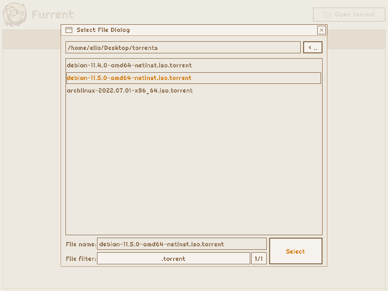
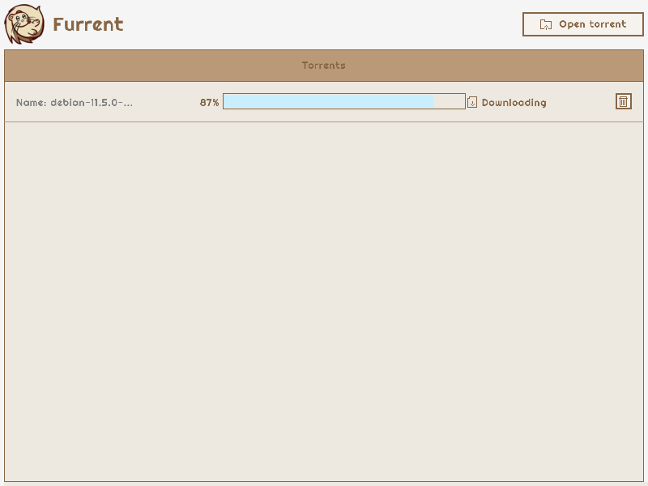
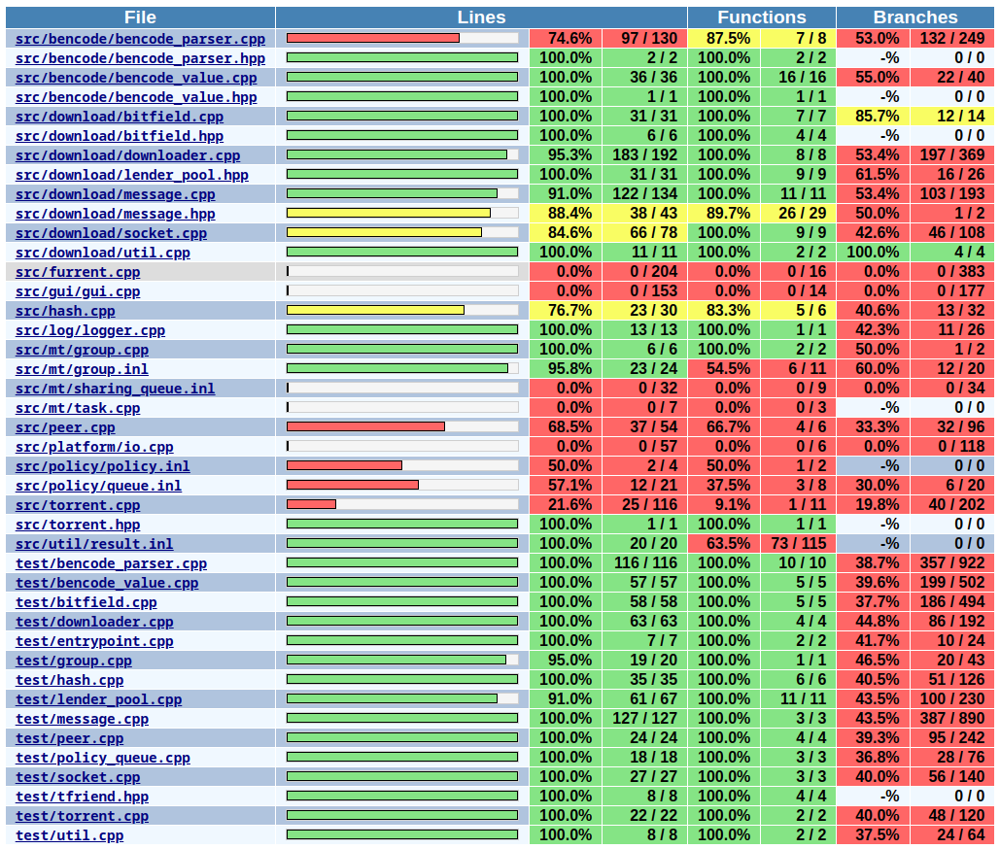

Furrent is a tiny BitTorrent client




## See it in action

https://user-images.githubusercontent.com/6002855/195927219-f23fc5ce-3f4b-4597-9fca-a973a9179515.mp4

The SHA256 sum should be equal to `e307d0e583b4a8f7e5b436f8413d4707dd4242b70aea61eb08591dc0378522f3` (see https://cdimage.debian.org/debian-cd/11.5.0/amd64/bt-cd/SHA256SUMS).  
Let's see if Furrent downloaded the file correctly.

```
$ sha256sum debian-11.5.0-amd64-netinst.iso 
e307d0e583b4a8f7e5b436f8413d4707dd4242b70aea61eb08591dc0378522f3
```

Yay!

## Documentation

The docs are hosted [here](https://furrent.github.io/furrent/annotated.html) and are automatically built in the cloud after every commit.

## Known limitations

- No [DHT](https://en.wikipedia.org/wiki/BitTorrent#Distributed_trackers) support (tracker-less torrents with
  decentralized peer discovery)
- No [web-seeding](https://en.wikipedia.org/wiki/BitTorrent#Web_seeding) support (seeding via HTTP to bootstrap a new
  torrent and speed up download)
- No [multi-tracker](https://en.wikipedia.org/wiki/BitTorrent#Multitrackers) support (although this is an extension to
  the original protocol, a basic implementation shouldn't prove too hard)
- No [UDP tracker](https://en.wikipedia.org/wiki/UDP_tracker) support (although popular and, for certain torrents, the
  sole option, this is also an extension
  to the original protocol and requires
  implementing [a whole new wire protocol](http://xbtt.sourceforge.net/udp_tracker_protocol.html))

All of these combined unfortunately result in many torrents being undownloadable by Furrent. e.g.:

- [ArchLinux](https://archlinux.org/download/) uses web-seeding and provides no tracker
- [Manjaro](https://manjaro.org/download/) uses a single web-seeder plus an UDP tracker

[Debian](https://www.debian.org/CD/torrent-cd/index.it.html) should work fine instead.

## How to

### Build the main executable

The requirements are:

- libcurl

When you have them set up, building Furrent is just:

```shell
$ mkdir build
$ cd build
$ cmake ..
$ make furrent
# A "furrent" executable should have appeared in the current directory.
# To copy it in the root bin/ directory also do:
$ make install
```

The instructions that follow assume that you have built Furrent and are in the `build/` directory.

### Build the documentation

You can build the documentation like so:

```shell
$ make doc
# A "doc" folder should have appeared in the current directory.
# To copy it in the root doc/ directory also do:
$ make install
```

Note that you will need to have Doxygen installed on your system.

### Build and run unit tests

You can run all tests like so:

```shell
$ make furrent_test
$ make test
```

Additionally, if you have Valgrind installed on your system, you can run the tests using that with:

```shell
$ ctest -C valgrind
```

### Gather coverage data

To enable coverage support, add the `-DCOVERAGE=ON` flag when running `cmake`. Then build the `furrent`
or `furrent_test`
executables. From now on you can use `make coverage` to spawn a `coverage.html` report. Note that you will need to
run the executables that you're interested in before you can see any actual coverage result (and also
run `make coverage`
every time you want to refresh the results).

This step requires you to have `gcov` and `gcovr` installed on your system.

### Enable sanitizers

We're using the undefined behaviour runtime sanitizer that will print a message to the console in the unfortunate
event that Furrent runs into any UB. To enable it, add the `-DUSAN=ON` flag when running `cmake`.

## Code quality
### Warnings, CLangTidy and CLangFormat
The flags `-Wall -Wextra -Wpedantic -Werror` are provided to the compiler. This means that any warning is turned into an error and almost all of them are enabled. Furrent should currently compile just fine with 0 warnings.

The `clang-tidy` static analyzer (linter) is used to include more sophisticated checks. Furrent should currently exhibit no
`clang-tidy` warnings except a couple related to the usage of a C library: raylib. The configuration file, `.clang-tidy`, is a modified version of a [dump](https://gist.github.com/ArnaudValensi/0d36639fb84b80ee57d0c3c977deb70e) from a recent version of the CLion IDE.

We're using the `clang-format` formatter to maintain a uniform code style. The configuration file, `.clang-format`, is taken from the Google convention.

### Coverage
Note that this is without running the GUI



### UB Sanitizer
```
Test project /home/elia/code/furrent_fork/build
    Start 1: tstandard
1/1 Test #1: tstandard ........................   Passed   63.76 sec

100% tests passed, 0 tests failed out of 1

Total Test time (real) =  63.76 sec
```
(Any UB would have produced an error log)

### Valgrind
```
==12439== HEAP SUMMARY:
==12439==     in use at exit: 0 bytes in 0 blocks
==12439==   total heap usage: 379,823 allocs, 379,823 frees, 55,922,506 bytes allocated
==12439== 
==12439== All heap blocks were freed -- no leaks are possible
```
